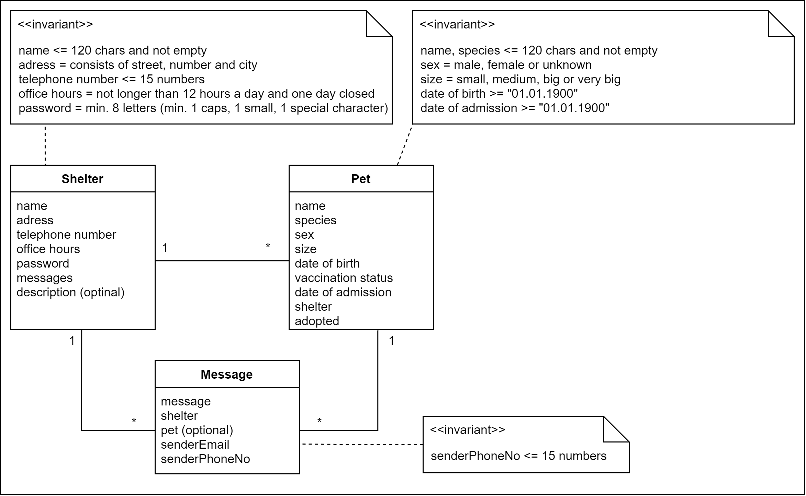
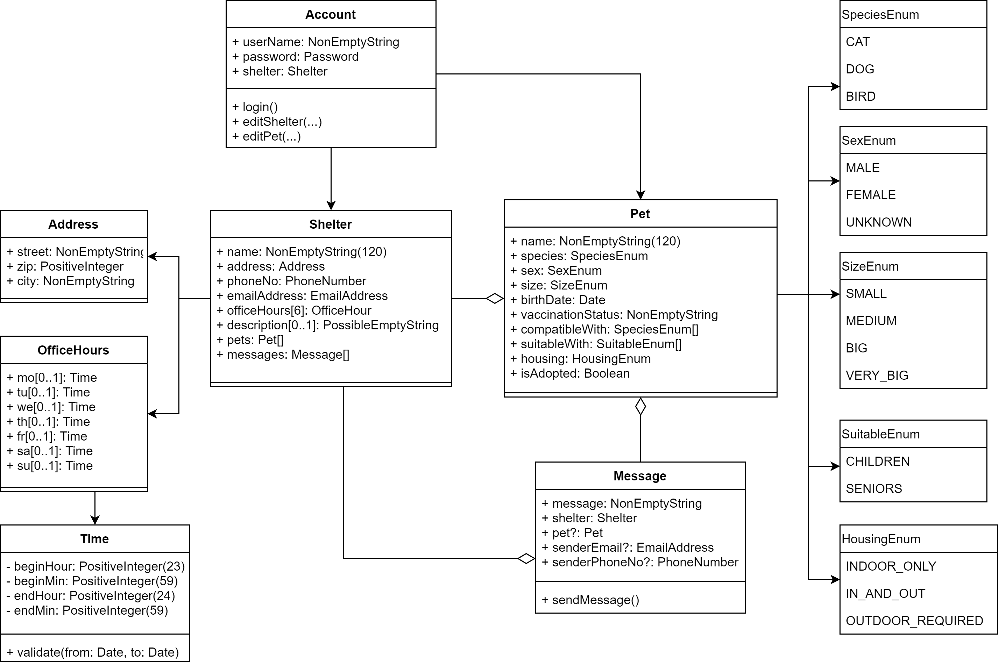

# Adopets

## Who we are

  

Our foundation is called "Give me home" and was formed in 2016 by a group of animal lovers. It all started with a spontaneous decision to “do a good deed” and donate some pet food to the shelter. However as we saw how much was needed, we couldn’t just tell ourselves “good job” and forget about the hundreds of hopeful eyes gazing at us. At first we were donating only from our own money, but as our good intentions were greater than our financial abilities, we started with fundraisers and so we are.

However even an endless river of money won’t save all of problems, as long as there are still homeless animals stuck in shelter and waiting for a loving family. We do our best to help them find new homes. All of us have adopted and we are trying to inspire people doing the same by organizing educational events and placing ads on our site on Facebook. We are constantly looking for new ideas to help more animals ‒ there is still so much we can do!

## What we do

Our mission is to find a home for as many homeless pets as possible. We cooperate with several animal shelters, other foundations as well as with individuals, so none of them is made to say “no” to an animal in need.

Our activities include:

* finding homes for pets through advertisements, educational events and talks with potential adopters,
* organizing fundraisers for animal shelters to provide essentials such as pet food, blankets etc.,
* organizing fundraisers for rescue actions and animal treatment,
* raising public awareness about pet adoption,
* raising public awareness and educating about pet sterilization and how it can decrease an amount of homeless animals,
* finding temporary homes,
* finding volunteers.

## Why we need the App

The decision to adopt an animal cannot be made spontaneously. A potential adopter has a lot to consider ‒ not only, if he has enough time and money, but also what he should expect from the animal and what he can offer it. If there is a mismatch between the adopted pet and the human, the pet often comes back to the shelter. It is harmful for both parties ‒ a pet loses its new home and a human may not be willing to adopt another animal.

Finding a pet which matches the adopter can be really time consuming as usually it involves visiting a shelter and talking with staff. Often a potential adopter at first takes a look at pets and asks only about these, which appearance he likes at most ‒ it is possible, that there is a perfect match for him, which he just didn’t notice. Besides nowadays, during the coronavirus pandemic visiting animal shelters got complicated.

With our app we want to provide a clear picture of what pets of what characters are up for adoption and where. The most important function of the application should be a filter, which allows to search for animal which fulfils the critical expectations of the user, e.g. child friendliness or tolerating other animals. If the distance doesn’t matter, potential adopter should be able to search through advertisement of many shelters.

The idea of the app is based on three list. The most important is the list of animals waiting for adoption, then there is a list of shelters with their contact information and the list of animals, who found home thanks to the app, what would both be an optimistic accent and build trust to the side. We want to avoid fake advertisements or sell offers, so each of our partner shelters should get an account, so only they can manage the advertisements. From the user side there should be no account needed ‒ they should be able only to search through the advertisements and sending a message to a shelter via a contact formula.

## What we expect from the app

1. Log in  
Each of our partner shelters (we will provide a list of them) should have an account, so only they can place, delete or change their ads. They should only be able to manage their own advertisements.

2. Change password  
Each of animal shelter should be able to change their password.

3. List of animal shelters  
Each animal shelter should have a name, address, telephone number, office hours and optionally short description.  
  a) shelter should be able to update this information  
  b) user should be able to retrieve the list to learn more about each shelter  

4. List of “looking for home”  
This list includes all pets put up for adoption. To help user find a perfect pet, it should allow to filter based on basic criteria ‒ there are listed in f).  
    a) shelter should be able to add a pet ‒ a pet must have a

        1. name  
        2. species  
        3. sex  
        4. size (small/medium/big/very big will be enough)  
        5. date of birth (month and year)  
        6. vaccination status  
        7. date of admission to the shelter  
        8. shelter it is in  

    Besides there are extra features listed in f), which should be optional.  
    By each of them there should be three options possible:
    yes, no and unknown

    b) shelter should be able to delete a pet’s advertisement. There should be option to check, whether the pet was adopted ‒ if yes, it should be added to the list of “found home” and the adoption counter should be increased.  

    c) shelter should be able to update information about pets  

    d) shelter should be able to retrieve the list to verify the data  

    e) user should be able to retrieve the list of pets  

    f) user should be able to filter the list of pets.  
    The most important criteria are:

        1. species  
        2. sex  
        3. size  
        4. age  
        5. shelter (possible choosing one or more)  
        6. accepts cats / accepts dogs  
        7. suitable for children / seniors  
        8. indoor only (cats)  
        9. can live in apartment / needs a big garden.  

    If some criteria is not relevant, user should have a possibility to choose “not important”. You are free to think of other criteria, which can help user finding animal, but breed cannot be one of them.  

5. Contact form
There should be possible some form of contact between user and shelter, if user is interested in one of pets or has a question.

    a) user should be able to access contact form (name, e-mail address, phone number, text message). Preferably there should exist one contact button for every pet, so the shelter instantly knows about what pet the message is  

    b) shelter should be able to retrieve the list of message. As we don’t want users to have to create an account, there is no answer possible ‒ shelter can contact them on the given e-mail or phone number.

6. List of “found home”  
Beside a list of pets looking for home, there should exist also a list of animals, who found home thanks to the app. To save time, pets should be automatically saved there, when they are deleting from “looking for home” list with checked option “adopted”. Preferably, there should be a date, when the pet was adopted.

    a) shelter should be able to delete an animal, if it was put there accidentally or it came back from adoption (then it should be put back on “looking for home” list)

    b) shelter should be able to retrieve the list to verify it

    c) user should be able to retrieve the list

7. Adoption counter
Somewhere on the page there should be visible a counter that shows how many animals found home thanks to the app.

## Name of App

Adopets

## Domain Name

adopets.de

## Requirements

| original | elaborated/improvements |
| -------- | ----------------------- |
| Login to shelter account (1.) | each partner shelter can login, user do not need to login |
| change password of shelter account (2.) | shelter is able to change password |
||
| Lists of ... (3.,4.,6.) | |
| ... animal shelters (3.b) | listing of shelters<ul><li>showing the attributes of a shelter (to learn more about it)</li><li>should be accessible to user </li></ul> |
| ... animal shelter (3.a) | Options for shelters:<ul><li>updating their information</li></ul>
| ... "looking for home" (4.[e,f]) | listing of pets to adopt ("looking for home") <ul> <li>showing the main attributes (like name, sex, age)</li> <li>filter for kind of pet (by given criteria)</li> <li>clicking on pet for detailed information (fully description of pet)</li> </ul> |
| ... "looking for home" (4.[a..d]) | Functionalities of shelters: <ul><li>add pets (with given attributes)</li><li>delete pet advertisement (adding it to list of "found home" when adopted)</li><li>update pet information</li></ul> |
| ... "found home" (6.) | list of pets that got adopted <ul><li>pet gets automatically added when deleted with option "adopted" (with date of adoption)</li><li>accessible for users</li></ul>Options for shelters:<ul><li>remove pet due to failure or return of adoption</li></ul> |
||
| Contact (5.a) | form to contact a shelter: <ul><li>directly</li><li>in combination with specific pet (button for contact at detail page of every pet)</li></ul> |
| Contact (5.b) | Contact receiving for shelter: <ul><li>retrieve list of messages</li><li>no reply option due to missing account of users</li></ul> |
| Adoption Counter (7.) | a counter that represents the number of conveyed pets (present on any page)

## Domain Model

## Design Model

## Run the project

### setup and edit

This project is entirely written in TypeScript and HTML. 
Further this is a NodeJS project meaning that the following steps have to be fulfilled before:

1. install `NodeJS` and `npm` ([Install instructions](www.fosstechnix.com/how-to-install-node-js-on-windows/))
2. run `$ npm i` in a terminal within the root directory to install the node dependencies
3. install the firebase-tools globally with `$ npm i -g firebase-tools`
4. log into firebase with `$ firebase login` with the account that is registered at the firebase project related to this repo

After that the project can be edited as following:

* Editable files are in `./app/src/` except ...
* The folder `./app/js/` should not be edited though there are the compiled JavaScript files, that will be overwritten after the building process.

### run

To run the project just open a terminal in the root folder and run `$ npm run watch` to start the watcher which compiles the edited Typescript code on save, or run `$ npm build` to compile the code once.

* After that just open the `./app/index.html` in the firefox development browser.
* Alternatively run `$ npm run serve` to run a local firebase server in your common browser (recommended)

### debug

To debug the code either use the dev tools from the firefox browser.
Alternatively (and easier) use VSCode for the development and simply go to the [Run and Debug Tab](F5) and run the Configuration `Launch index.html`. Therefore the installed Firefox Browser will be opened in debug mode and the breakpoints that have been set in the files will be awaited.

## Division of Work

Christian Prinz: Pet Class 
Max Bergmann: Shelter Class
